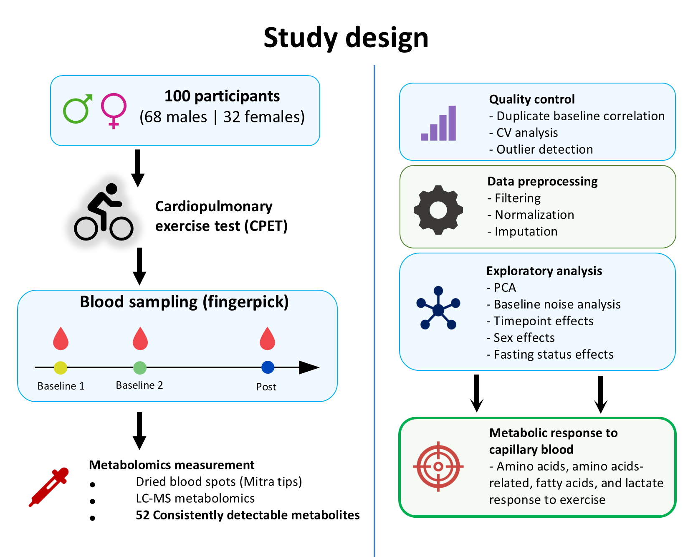
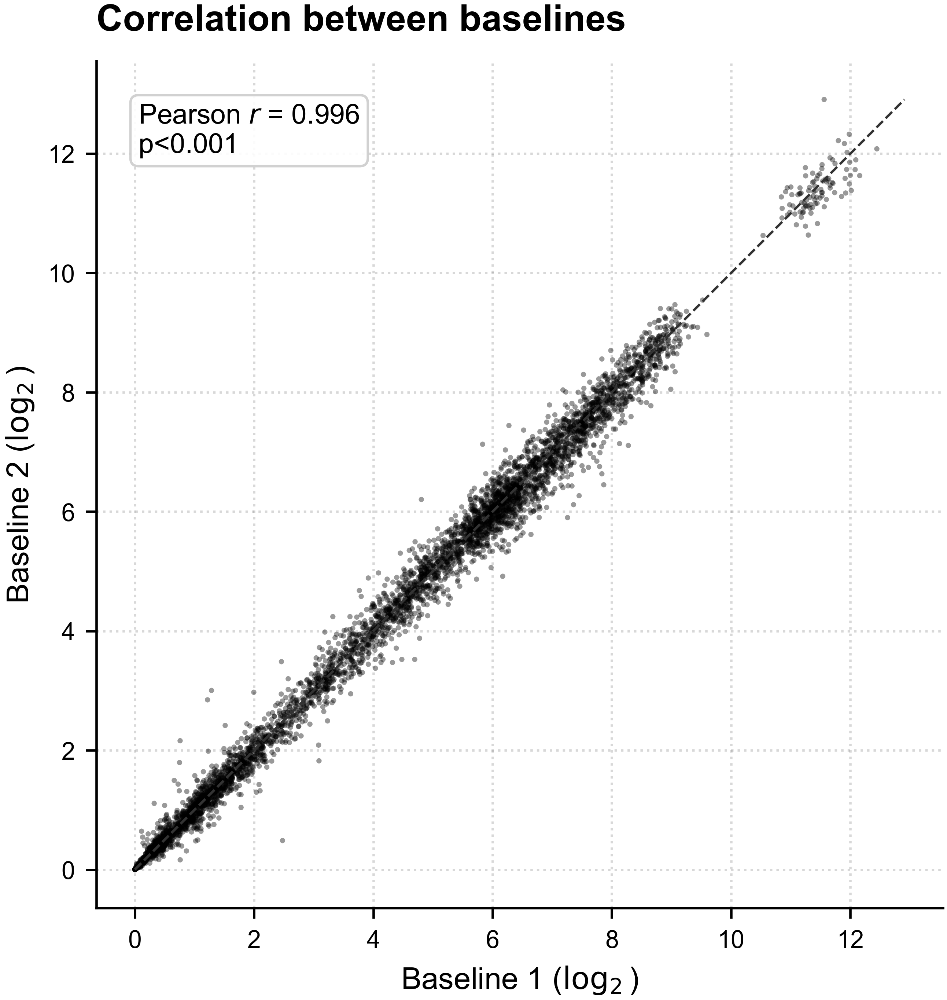
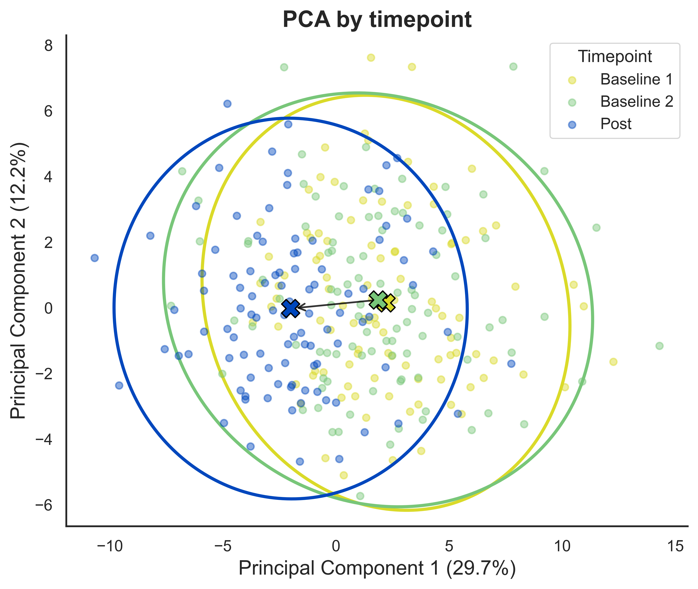
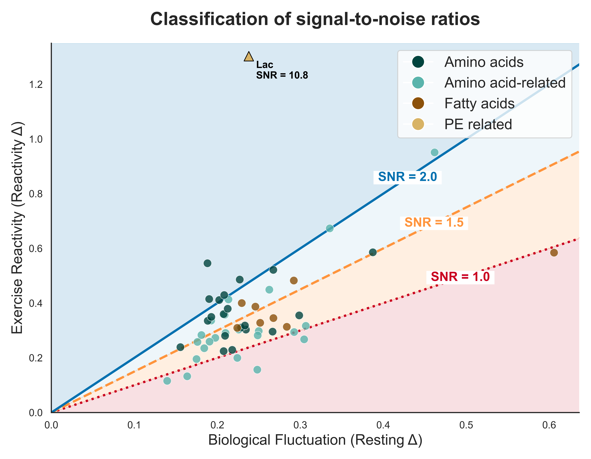

# Noise-aware Capillary Metabolomics for Exercise Response Analysis

This repository presents a public portfolio version of my Master's thesis project on capillary blood metabolomics, cardiorespiratory fitness and acute exercise response.

The original research project was carried out in collaboration with TU Dortmund and Biolyz, and focused on the analysis of repeated-baseline capillary blood metabolomics data collected around maximal cardiopulmonary exercise testing.

The public version of this repository does **not** include raw biomedical data or participant-level datasets. Instead, it provides a clean and reproducible demonstration of the main methodological ideas using synthetic data.

---

## Project overview

Acute exercise metabolomics is often based on a single pre-exercise baseline measurement. However, this makes it difficult to determine whether post-exercise metabolite changes truly exceed short-term resting variability.

This project addresses that limitation by using two pre-exercise baseline samples to estimate baseline-derived methodological noise. Post-exercise metabolite changes are then interpreted not only in terms of statistical significance, but also relative to short-term baseline variability.

The main objective is to distinguish broad group-level metabolic perturbations from responses that more clearly exceed baseline noise.

---

## Main analytical components

The original analysis workflow included:

- metabolomics data preprocessing and quality control;
- metabolite filtering and transformation;
- repeated-baseline reliability analysis;
- exploratory PCA and multivariate analysis;
- single-baseline post-exercise response analysis;
- signal-to-noise analysis of exercise-induced metabolite responses;
- participant-level determinant analysis;
- VO₂peak prediction using regularized regression and nested cross-validation.

---

## Visual overview

### Study design



### Baseline reliability



### Exercise-induced metabolomic shift



### Noise-aware response analysis



> Note: Figures are included for portfolio and methodological presentation purposes. Raw participant-level data are not publicly available due to privacy and collaboration constraints.

---

## Repository structure

```text
capillary-metabolomics-exercise-response/
├── data/
│   └── README.md
├── figures/
├── notebooks/
│   ├── 01_noise_adjusted_metabolomics_demo.ipynb
│   └── 02_vo2peak_prediction_demo.ipynb
├── reports/
│   └── project_summary.md
├── scripts/
│   └── run_synthetic_workflow.py
├── src/
│   ├── __init__.py
│   ├── synthetic_data.py
│   ├── reliability.py
│   ├── response_analysis.py
│   └── modeling.py
├── README.md
├── requirements.txt
└── .gitignore
